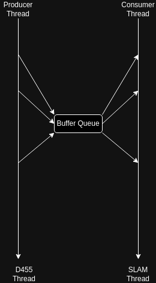

## Multi-threaded map creation using RS 455/435 and Lego-LOAM

This project Aims to replace ROS dependent IPC between Sensor and SLAM algorithm. Thus reducing [network traffic](https://github.com/ros/ros_comm/blob/845f74602c7464e08ef5ac6fd9e26c97d0fe42c9/clients/roscpp/src/libros/xmlrpc_manager.cpp#L116) on the network ports that ROS uses and redirecting that on the CPU level, thus reducing the failure case for the sensor. The internal code for Lego-LOAM is not yet modified to non ROS components but that needs to be done as done in other traditional SLAM approaches. Transferring point clouds is a resource intensive task and introduces latency in the autonomy stack this project aims to minimise that.

### Software architecture:

A simple producer thread writes to an `std::queue` of finite length, and the consumer reads from the end of the FIFO queue.The entire transaction of data is mediated using `std::unique_lock`. 

  

At this point it makes sense to use reader writer however, since the queue could have multiple algorithms reading from it, we use producer consumer and make sure that multiple readers can read-access the critical section.